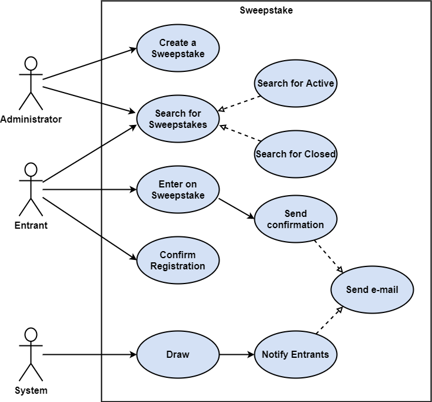

# Sweepstakes

This sweepstakes app intends to be an example of how to implement a Clean Architecture.

# Clean Architecture

The Clean Architecture is a type of Software Architecture created by Robert
C. Martin that indents to be:

 * Independent of Frameworks;
 * Testable;
 * Independent of UI;
 * Independent of Database;
 * Independent of any external agency.

Its primary idea consists on decouple the business layers from frameworks,
databases, libraries and user interfaces in order to allow the replacement
of obsolete parts of the system and to build a system that is intrinsically
testable, with all the benefits that implies.

# Use Cases

An Administrator creates a Sweepstake. Entrants apply to sweepstakes. On
the sweepstake date, the System draws a winner and notifies the result by
e-mail to all entrants. Administrators and Entrants may search for running
sweepstakes and also closed sweepstakes.

