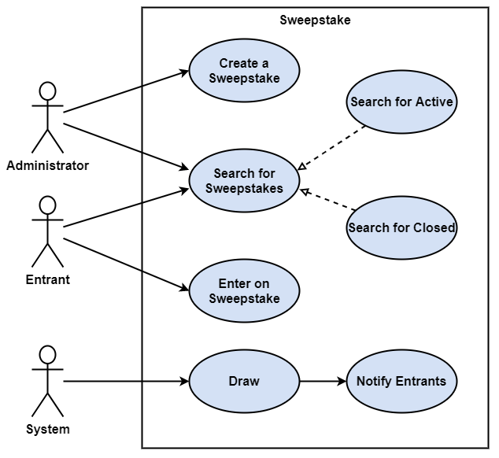
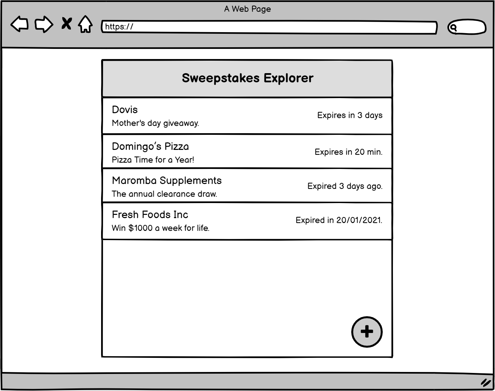
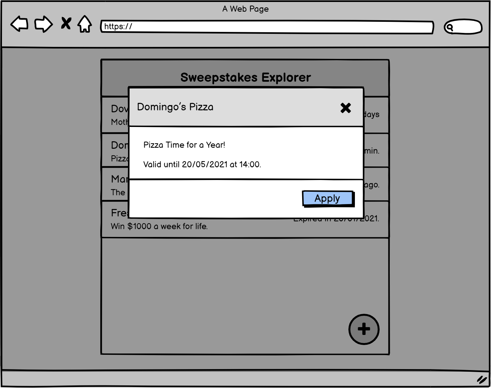
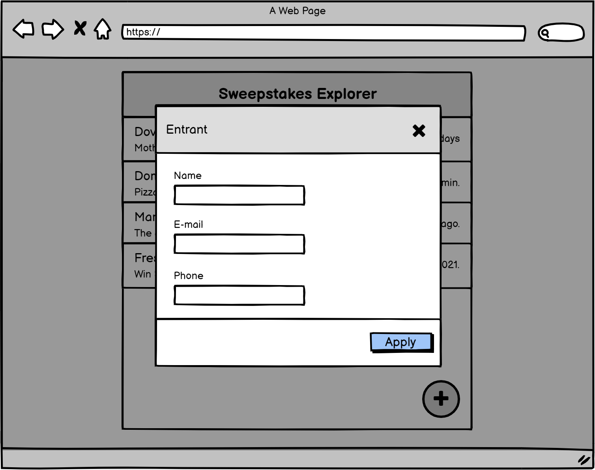
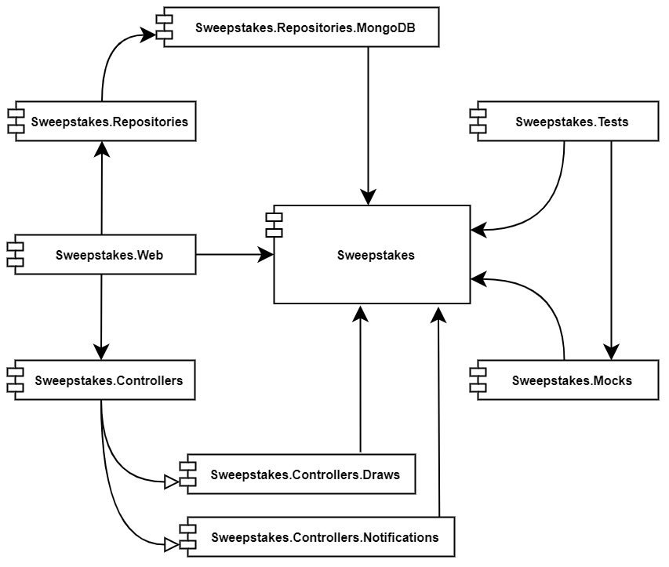

# Sweepstakes

This sweepstakes app intends to be an example of a Clean Architecture implementation.

# Clean Architecture

The Clean Architecture is a type of Software Architecture created by Robert
C. Martin that indents to be:

 * Independent of Frameworks;
 * Testable;
 * Independent of UI;
 * Independent of Database;
 * Independent of any external agency.

Its primary idea consists on decouple the business layers from frameworks,
databases, libraries and user interfaces in order to allow the replacement
of obsolete parts of the system and to build a system that is intrinsically
testable, with all the benefits that implies.

# Use Cases

Summary of the use cases:
 * An Administrator creates a Sweepstake.
 * Entrants apply to sweepstakes.
 * On the sweepstake date and time, the System draws a winner and notifies
the result by e-mail to all entrants.
 * Administrators and Entrants may search for running sweepstakes and also
expired sweepstakes.

  

# Wireframes

  

  

  

# Components

The components of this solution are:

## Sweepstakes

This component has all the entities, the business rules and the use cases.
In addition, this component exposes the interfaces from which it expects to
be implemented to be injected into the use cases.

## Sweepstakes.Controllers

This component allows to inject all implementations of controllers.

## Sweepstakes.Controllers.Draws

This component handles the draw process.

## Sweepstakes.Controllers.Notifications

This component handles the e-mail notifications.

## Sweepstakes.Repositories

This component allows you to inject all repository implementations, which
is currently only MongoDB.

## Sweepstakes.Repositories.MongoDB

This component constains a repository implementation.

## Sweepstakes.Web

This component glues all components and exposes an user interface.

## Sweepstakes.Tests

Unit test project.

## Sweepstakes.Mocks

This component mocks all external dependencies for unit testing. So that
decouples the Sweepstakes.Tests from any external libraries.

  

